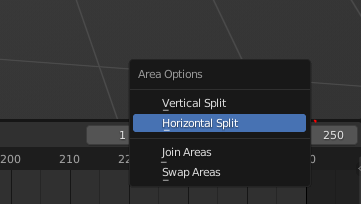
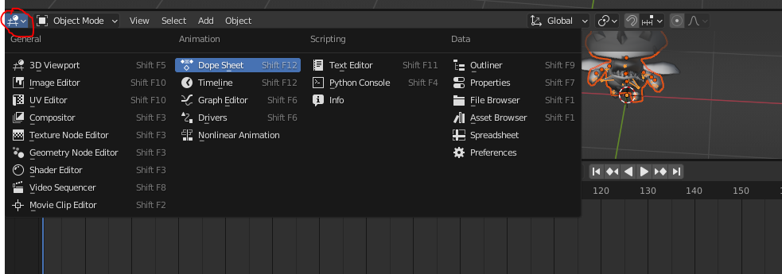
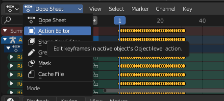
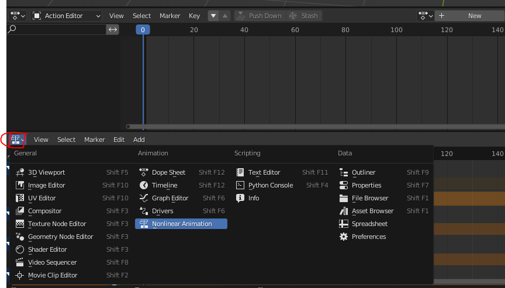
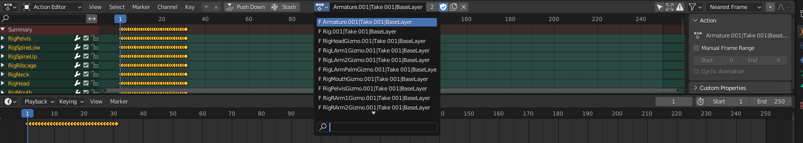
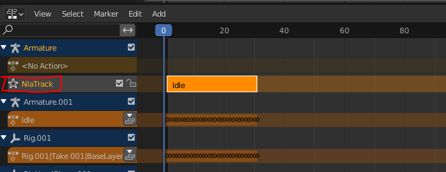
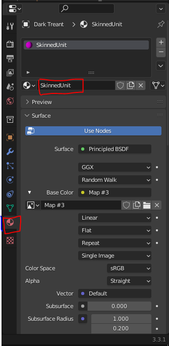
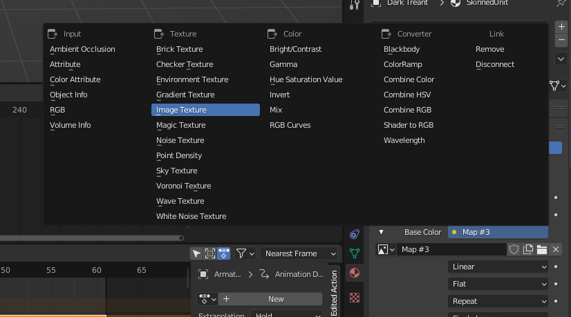
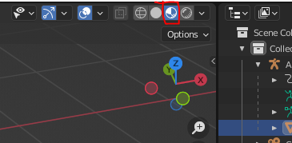

# (Unity) FBX with animations to blender

- Assumes that FBX animations are seperated, and there is one skinned model without animations. According to animations have the format <Model Name>@<Animation Name>.FBX

- Import the FBX with only the mesh and armature.  You will note 

- Import the FBX that has your desired animation. (usually this is <Model Name>@<Animation Name>.FBX). Note that the new nodes/armature/mesh will be postfixed with '.00X'

- Setup your UI. Right click, select **Horizontal Split** and change it to **Dope Sheet**. Then switch the dropdown next to it from **Dope Sheet** to **Action Editor**

- Switch your **Timeline Editor** to **Nonlinear Animation**

## Migrating animations

- Goto the **Action Editor**. You will see many actions with the format 'ObjectName|Take|Layer'. Our job is to integrate them with the original mesh and any additional nodes

1. Select your original **Armature**, the one without animations.

2. Rename 'Armature.001|Take|Layer' to <animationName>. 

3. Hit 'Push down' button. Note **NlaTrack** has been created (in red). Rename it to Idle. Then delete the mesh, and the parent armature (postfixed with .001) .

- Repeat the steps 1 to 3 for each animationnode/animation pair (eg. Rig node with Rig.001, etc), but with '_<animationname>' for the renaming in the action editor.

- The renaming of Nla animation tracks can be done all at once before importing another animation

- Repeat for all other animations

## Material names and textures

- Select your mesh, rename it's material to "SkinnedUnit"

- Also change Base color to image texture, and pick your texture (for engine consumption purposes, follow the docs to name it (eg. <..>_a.png, <..>_b.png))

- Select viewport shading to view/spotcheck the texture in the scene 

