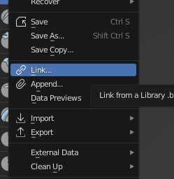
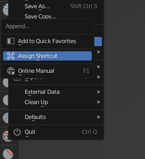
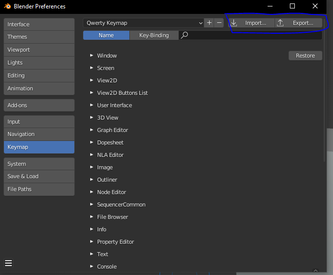

# Controls

- Download and import `controls/qwerty_keymap.py` under Edit->Preferences->Keymap. This will switch your object manipulation tools to use QWERTY.

### Adding shortcuts and 

- Right clicking a context menu item will give you another context menu. One of the options is "Assign Shortcut", click it, follow the instruction to assign a shortcut.

You can do this with the left sidebar icons and most other buttons.

### Exporting

- Edit->Preferences->Keymap, click on the export button

