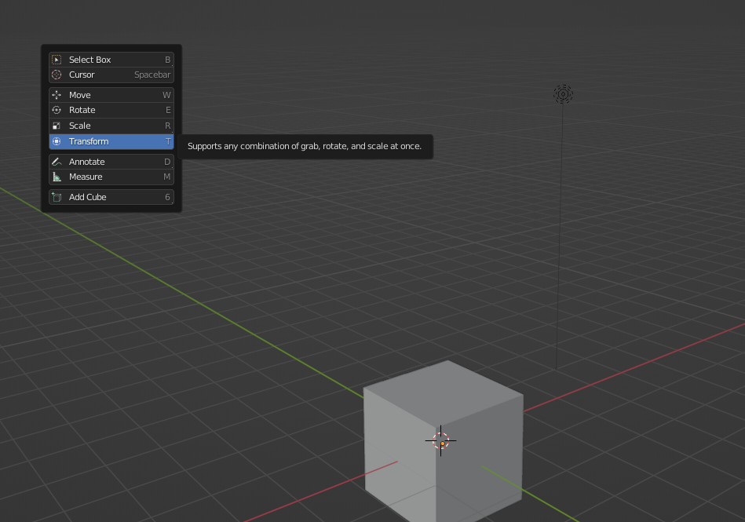

## Interface

- If you load up a blender file where all the side panels are missing and only the scene is there, **Ctrl-Space** will pull them back and vice versa

- **Shift-Space** will bring up a context menu relevant to that mode.

Many more explanations on other panels in the video, but optional to know 

(Interface Overview - Blender 2.80 Fundamentals)[https://www.youtube.com/watch?v=8XyIYRW_2xk&list=PLa1F2ddGya_-UvuAqHAksYnB0qL9yWDO6&index=4]

### Deleting

- Hotkey: x
