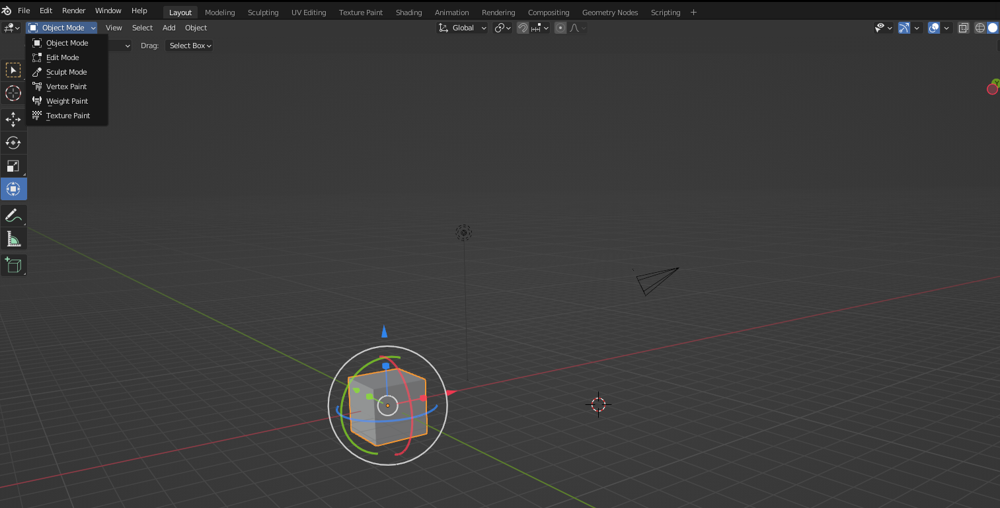
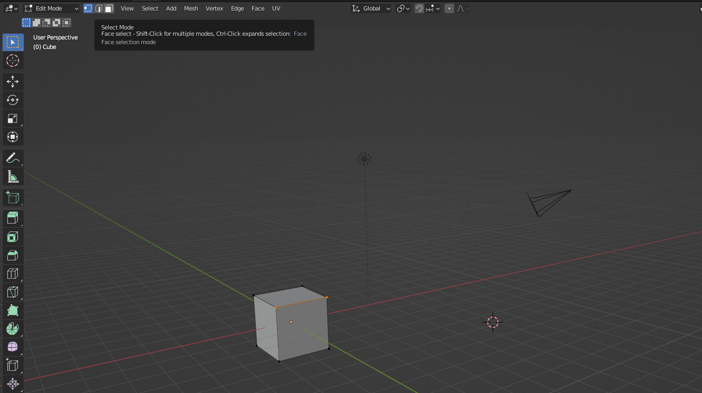
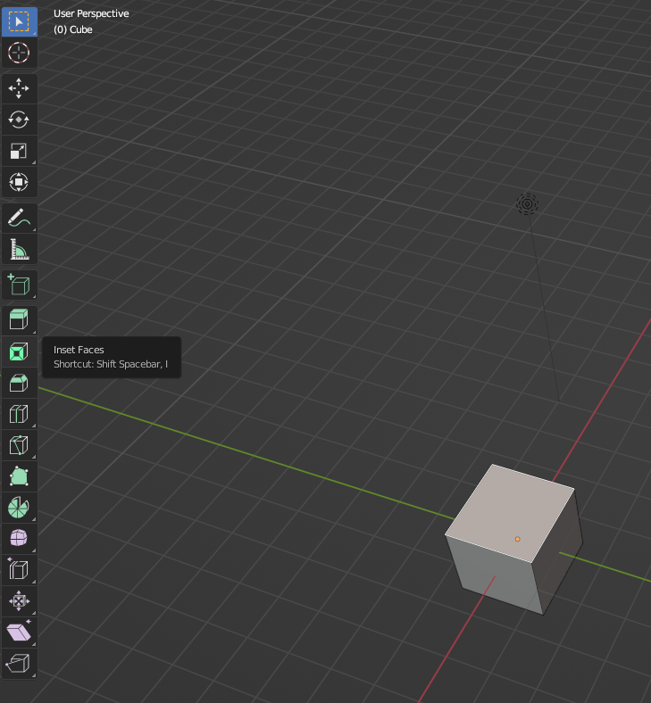

## Modelling

- Select an object, choose the **Edit mode** from **Object Mode** dropdown at the top

- You can select vertices, edges and face via the icons next to **Edit Mode**. Use hotkeys 1/2/3 to switch between them12

- There is a bunch of tools you can use, whose icons are located at the left sidebar

- Transform tools will work as usual on vertices/faces/edges (with some exceptions)

- **Alt-LeftClick** will select a loop of edges/faces, very useful!

### Modelling via Extruding

- Select a face/edge, press E, and move your mouse

#### References

- [Modeling Introduction - Blender 2.80 Fundamentals](https://www.youtube.com/watch?v=7bHleRTEmZ0&list=PLa1F2ddGya_-UvuAqHAksYnB0qL9yWDO6&index=8), videos from 8 to 15