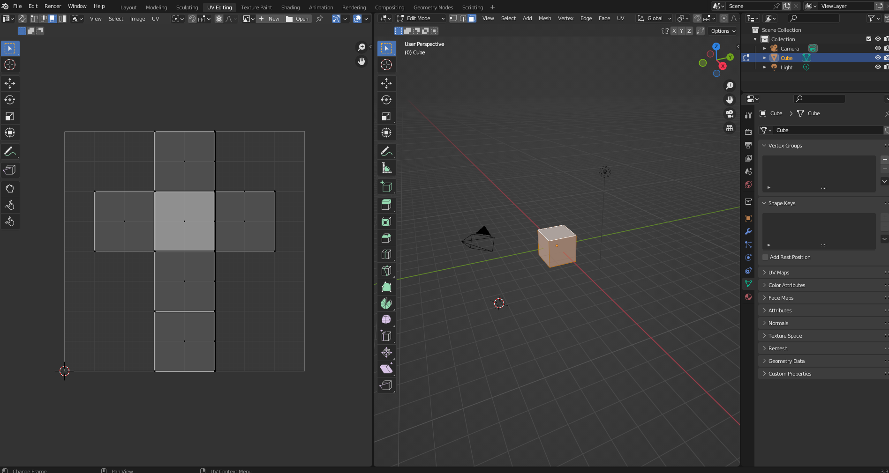
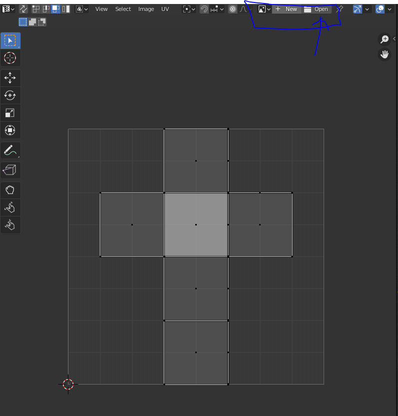
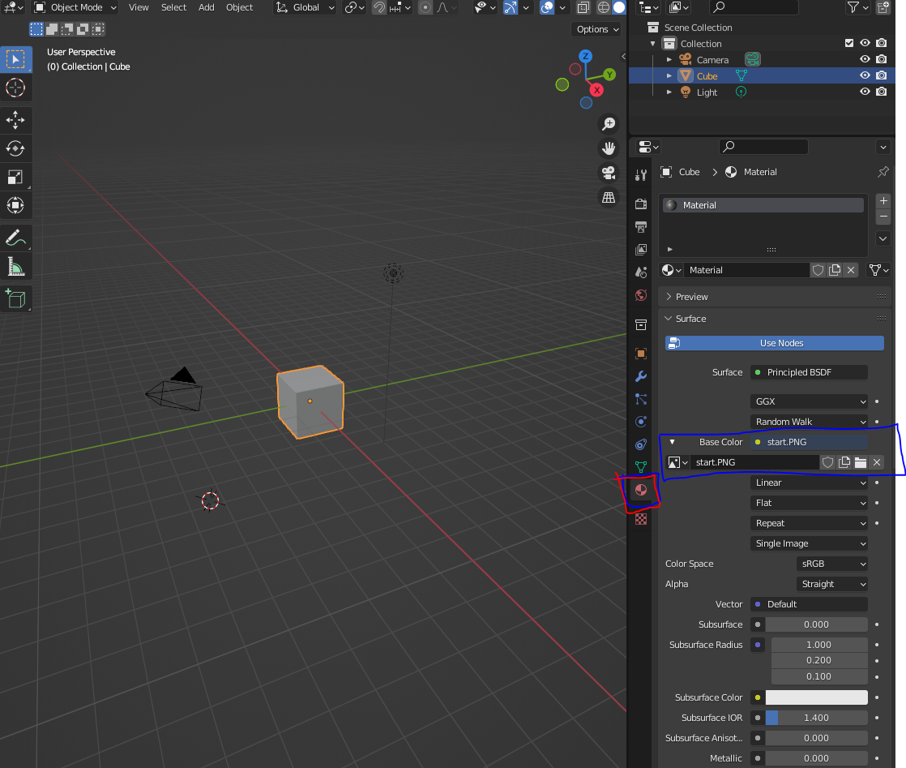
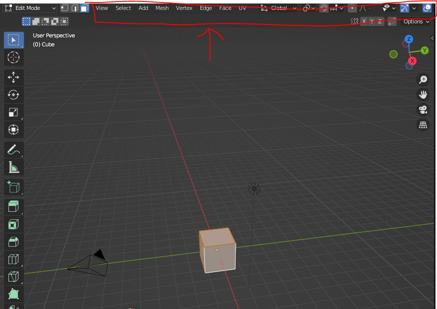
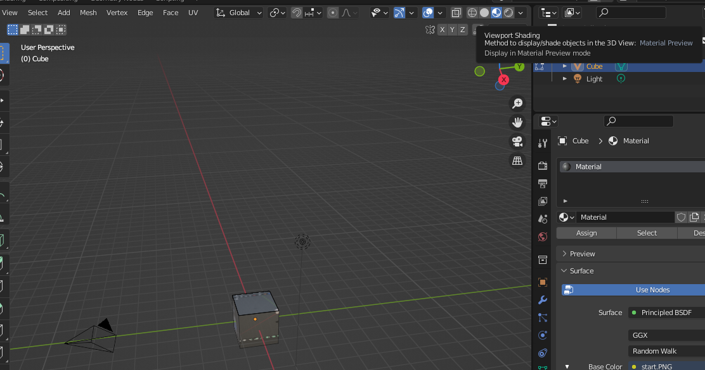
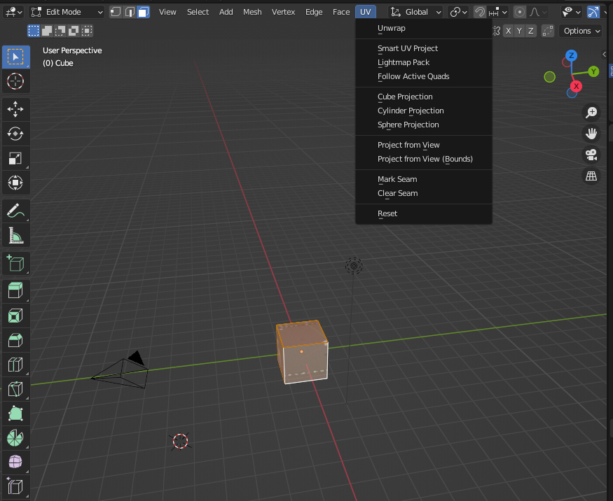
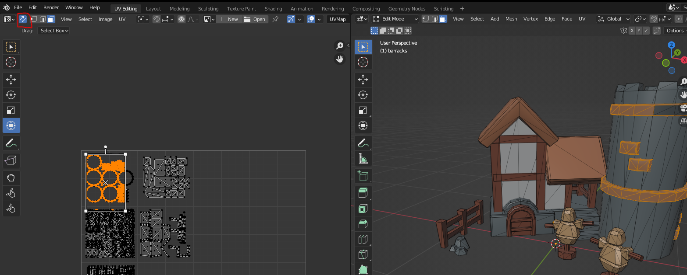
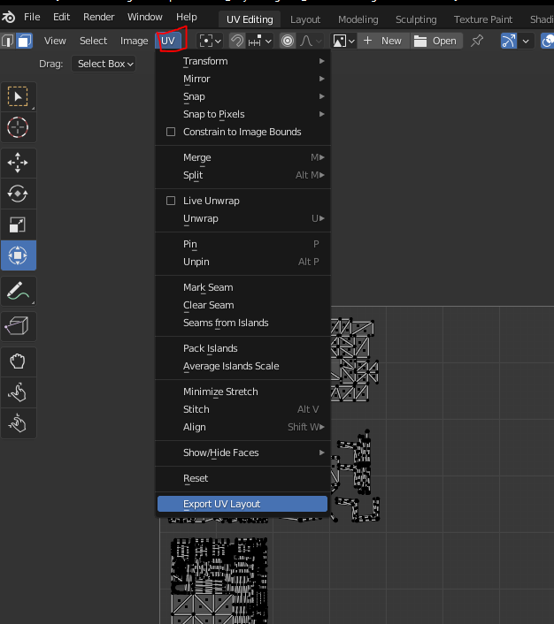

## UVing

- Goto **UV Editing** mode, you'll see 2 side by side panels, left representing the texture map, right being the scene

- Select a face in the scene and press A to select all faces.

- Adjust the polygons on the left side as you see fit. You can manipulate them with the QWERT keys, and 1/2/3 keys to select verts/edges/faces

- You can also load in an image on the left panel, but usually if the model is already prepped by an artist it should be there

### Object Texturemap Usage
- To see what UV map the object is using, go to **Material Properties** on the right side panel, and you see a **Base Color** linking to an **Image texture**

### View texture mapped object in your scene
- To see the texture in your scene, move your mouse cursor to the topbar mousewheel, scroll down all the way

- then press the **Viewport Shading** icon

### Unwrapping 

- Select your faces to unwrap

- Open up the **UV** menu and select your desired UV unwrap algorithm. This is usually sits within the domain of a texture artist.

### Selecting faces in UV and seeing what is selected in scene 

- Hit the **UV Sync Selection** in the 2D panel and select faces in that panel; it will reflect accordingly in the scene

### Exporting UVs

#### References

- [UV Unwrapping - Blender 2.80 Fundamentals](https://www.youtube.com/watch?v=Y7M-B6xnaEM&list=PLa1F2ddGya_-UvuAqHAksYnB0qL9yWDO6&index=19)