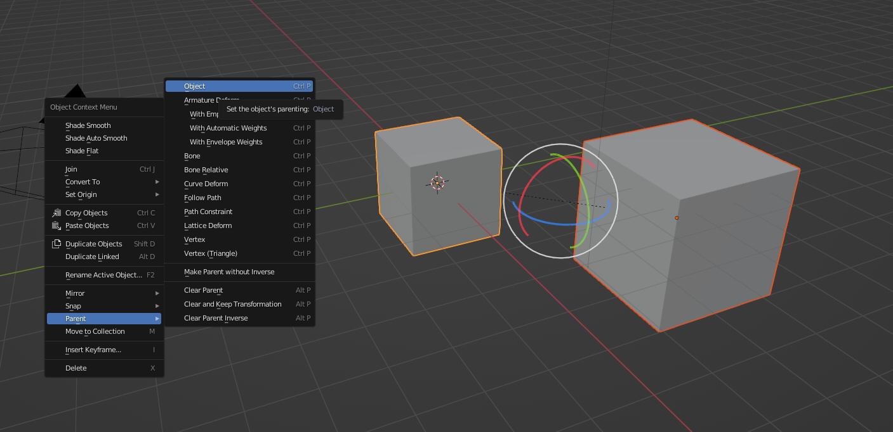
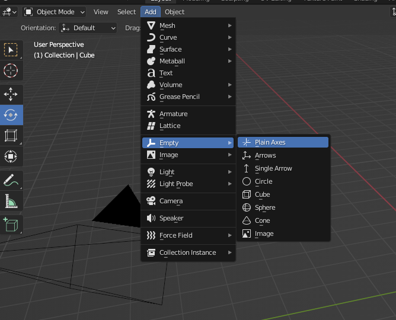

## Parenting

- Select your **child** object, then select your **parent** object with the **Shift-LeftClick**, make sure your parent object is the last selected (highlighted in yellowish-orange).

- **Ctrl-P** or **Right-click->Parent->Object** to parent your child to parent

- Rotate/move your parent to confirm the results

- **Alt-P** to clear parents

## Emptys

- Invisible handles/transforms used for convenience and never appears in rendering

#### References:

- [Rigging Intro - Blender 2.80 Fundamentals](https://www.youtube.com/watch?v=-gIL6VZ-bkE&list=PLa1F2ddGya_-UvuAqHAksYnB0qL9yWDO6&index=28)

- [Parenting Intro - Blender 2.80 Fundamentals](https://www.youtube.com/watch?v=GS452KMVWKA&list=PLa1F2ddGya_-UvuAqHAksYnB0qL9yWDO6&index=29)