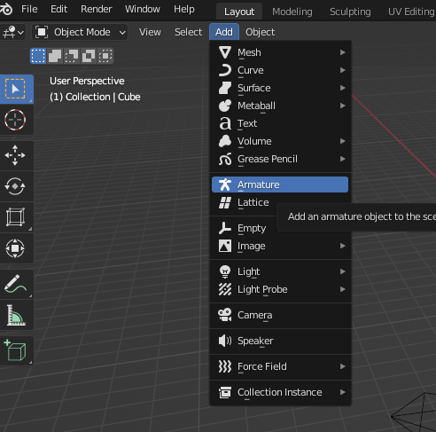
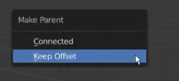
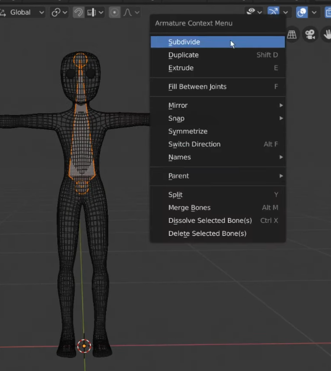
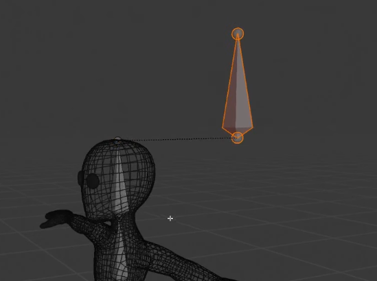
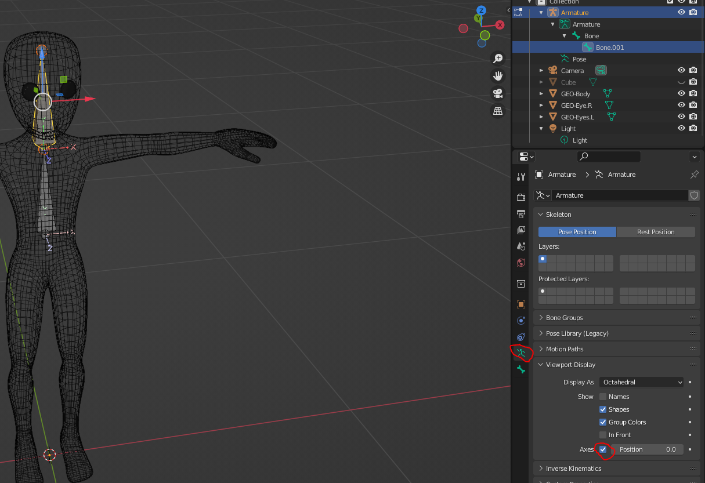
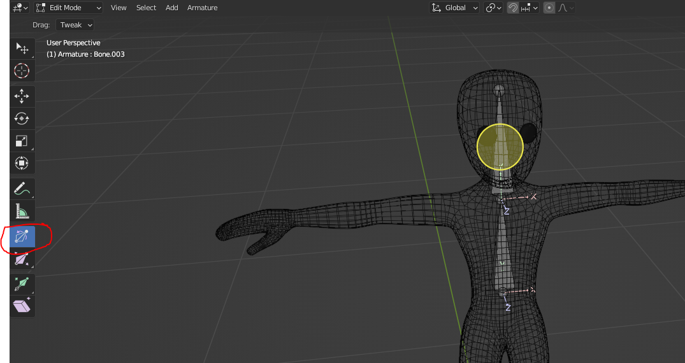
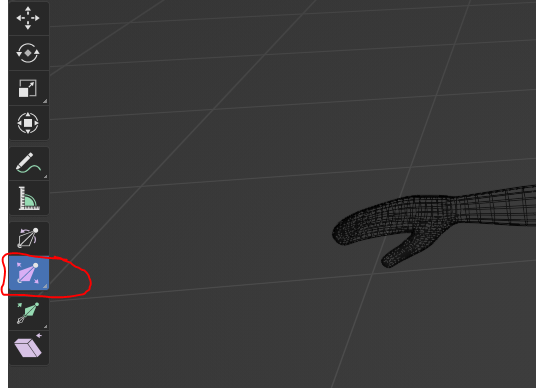
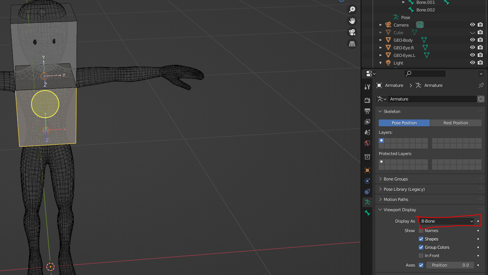
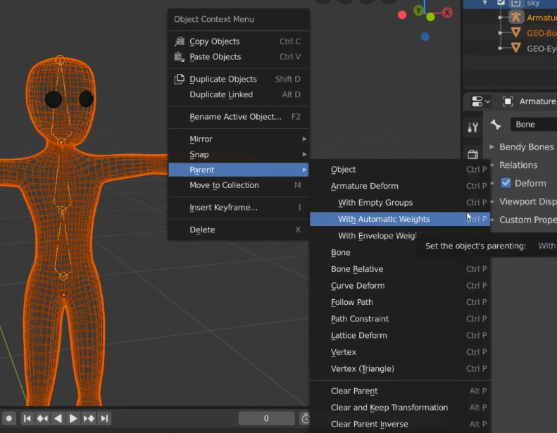

## Armatures

- To add, Add->Armature. A single bone will be added

- Choosing **Edit Mode** while selecting bones lets you edit bones, while **Pose Mode** is where you manipulate individual bones of the armature for animation.

- The sphere at the pointy end of the pyramid is called the **tail**, the other is called the **head**. 

- Within **Edit Mode** each part can be **manipulated** by the usual QWERTY tools, with certain effects on the relative parent.

### Adding Bones, attaching them

- **E** while selecting a tail to extrude a new bone from that tail, they are connected by default.

- Alternatively, see [**2:23** of the video](https://youtu.be/cZ3o5tjO51s?si=dYiJF9KuX88VHI--&t=152) for a method whereby you make a new bone and parent it with 2 options.

The **Keep Offset** option is useful for things whereby you need an offset, eg. nodes to place attachments

- A third way is selecting the bone, **Right click** and using **Subdivide**

### Delinking bones

- **Alt-P**, or **Clear Parent**, presents 2 methods: **Clear Parent** and **Disconnect Bone**

- **Disconnect Bone** allows you to move the bone away from it's parent's tail, but **keeps the parent child relationship**.

- **Clear Parent** severs the parent child relationship

- See [4:24 of the video](https://youtu.be/cZ3o5tjO51s?si=MPH9syINsqjqhXL9&t=264) for demonstration

### Visual Aids

- While selecting a bone, select the tab on the right panel called **Object Data Properties**, check **Axes** to show the Axis-es of bones.

### Manipulation Tool: Roll

- [5:49 of video](https://youtu.be/cZ3o5tjO51s?si=at3rO4cUe_T_dWe6&t=347)

### Test model 

- Import **sky_merged_mesh.obj** for rigging, skip this step if you already have an existing rigged model. There should be 1 body and 2 seperate eyes

## Envelops

- Can modify Bone envelopes via the **Bone Size** tool, needs visual aid to be seen

### Visual Aid: Envelops

- While selecting a bone, select the tab on the right panel called **Object Data Properties**, choose **Envelop** or **B-Bone** from the **Display As** dropdown option

## Attaching armature to mesh

- Select the mesh, shift select the armature object, **Right Click**, select **Parent**->**Armature Deform**->**With Automatic Weights**

#### Reference

- [Armatures - Blender 2.80 Fundamentals](https://www.youtube.com/watch?v=cZ3o5tjO51s&list=PLa1F2ddGya_-UvuAqHAksYnB0qL9yWDO6&index=30)