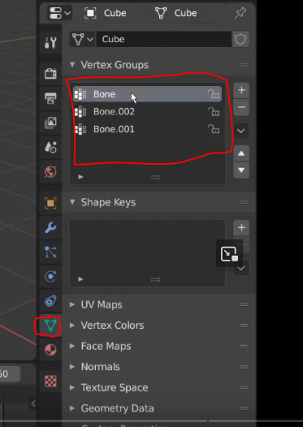
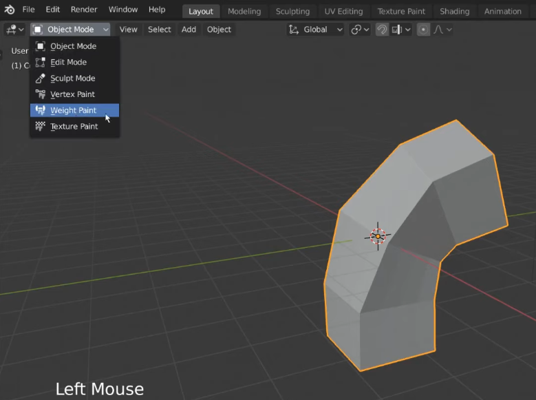
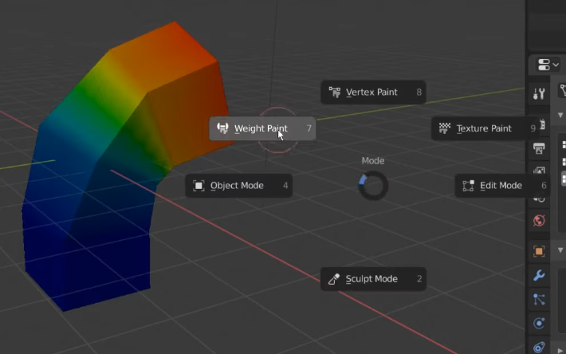
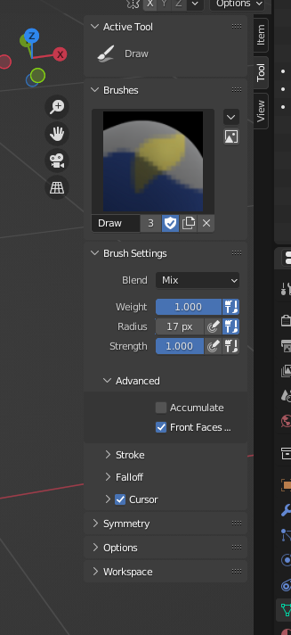
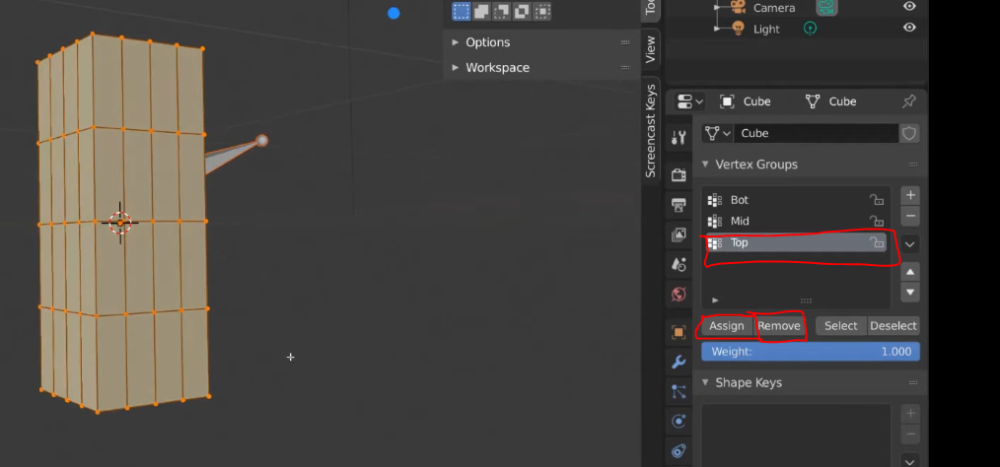

## Seeing what bones controlling the mesh

- **Object Data Properties** -> Vertex Groups

## Seeing the skin weights on polygons

- Select the mesh, switch mode to **Weight Paint**.

- Alternatively, **Shift-Tab** to bring up the pie menu, choose **Weight Paint**.

- If you select the different bones under **Vertex Groups**, you can see the colors change accordingly.

Red vertices are weighted at 100%, 50% is green, and blue is 0%

## Painting weights 

- Use the tools at the left side of the scene

### Changing brush settings

- Be in **Weight Paint** mode

- **F** while mouse is in viewport will bring up 2d circles, size your brush size via mouse move, and **Left click** to confirm, right click to cancel

- Right clicking will bring up a text/number entries for modifying your brush 

### More options for brush

## Setting weights via selecting vertices

- Be in **Edit Mode** while selecting your mesh, have the **Object Data Properties** tab active

- Box select vertices you want to change weights for, and select the bone in the vertex groups.

- Hit **Assign or Remove** buttons 

- Go back to weight paint mode to see results

References:

- [Vertex Groups - Blender 2.80 Fundamentals](https://www.youtube.com/watch?v=dKZrzG5r13g&list=PLa1F2ddGya_-UvuAqHAksYnB0qL9yWDO6&index=36)