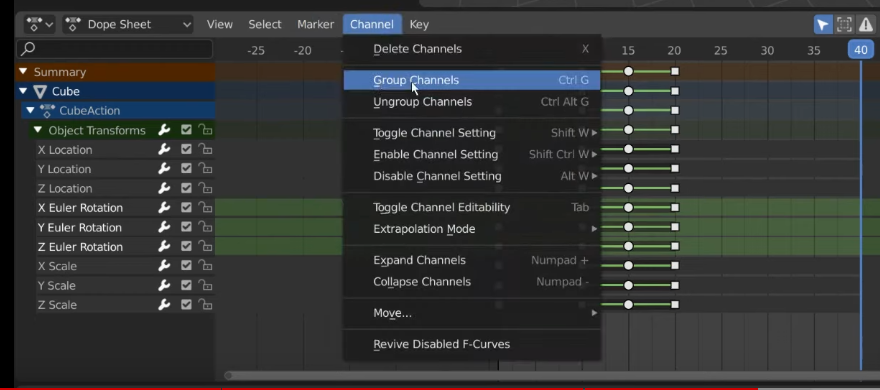

# Keyframes 

## Inserting Keyframes

- Select something in the scene or mouseover a numeric input box, right click and choose **Insert Keyframe**, alternatively hotkey **I**

- The values that are keyframes will show up in yellow, if they are interpolated they will be in green

### Automatic Keyframing

- See [3:48](https://youtu.be/SZJswvw9wEs?si=Ylj-dz823CuWlOVo&t=228)

- Click the **Record** icon in the timeline editor, manipulate the object to automatically keyframe it, shift to another frame via timeline editor and repeat.

### Deleting Keyframes

- Select keyframes in dopesheet/timeline editor, hit **X** or **Delete**. Selected keyframes are highlighted in orange

 

### Duplicating Keyframes

- **CtrlC**, then **CtrlV** on another keyframe works. **Shift-D** also works.

- Note that if that is no change between keyframes, an bar will show up like so: 

### Rezooming keyframes

- **Home** hotkey while selecting animated object

# Timeline

- **Alt-WheelScroll** to move the current frame in the Timeline Editor (make sure blender is selected). **Left/Right Arrow key** also does the same.

- Set the end frame to limit the number of frames.

## Scaling keyframes in timeline

- Press **A** to select all keyframes, then **S** to scale them up.

# Dopesheet

- Has more features compared to timeline

- click the **>** arrow on the left side of the dopesheet and expand the dropdown for a listing of values interpolated

- To change the interpolation type of a value, select a keyframe (or multiple), right click, **Interpolation Mode**->**Constant/Linear/Bezier**

- Green lines between keyframes indicate that interpolation is not **Bezier**. Also, **Constant** interpolation is useful for navigating between keyframes.

### Selecting multiple keyframes

- **Alt-click** on a keyframe

### Grouping Channels

- For easier mgt, you can group channels together via **Channel->Group Channels**

### UI view aids

- The **View** menu has a bunch of useful visual aid options, see [6:03](https://youtu.be/LHdh8p37yM8?si=-ESOhmvLf5bjMorn&t=363)

- **View->Set Preview range** limits animation ranges

- **View->Show Sliders** shows input on the list of channels to the left of the dopesheet

# Graph Editor

- You can see the curves used for animation here, more for advanced users.

### Reference

- [Keyframes - Blender 2.80 Fundamentals](https://www.youtube.com/watch?v=SZJswvw9wEs&list=PLa1F2ddGya_-UvuAqHAksYnB0qL9yWDO6&index=38)

- [Timeline - Blender 2.80 Fundamentals](https://www.youtube.com/watch?v=o19U-yPGdyY&list=PLa1F2ddGya_-UvuAqHAksYnB0qL9yWDO6&index=40)

- [Dope Sheet - Blender 2.80 Fundamentals](https://www.youtube.com/watch?v=LHdh8p37yM8&list=PLa1F2ddGya_-UvuAqHAksYnB0qL9yWDO6&index=40)

- [Graph Editor - Blender 2.80 Fundamentals](https://www.youtube.com/watch?v=zHlln3AzeMs&list=PLa1F2ddGya_-UvuAqHAksYnB0qL9yWDO6&index=41)