# Animation via NLA

## UI setup

- Right click on the edge of layout, **Horizontal Split** to include a new panel.

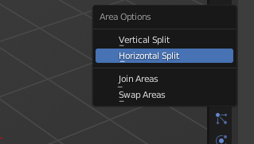

- Then switch the new panel to **Dope Sheet** via it's top left icon, then click on the dropdown **Dope Sheet** and pick **Action Editor**. Note that the **Action Editor** has to be accessed via **Dope Sheet**.

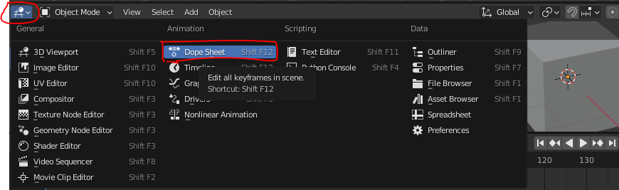  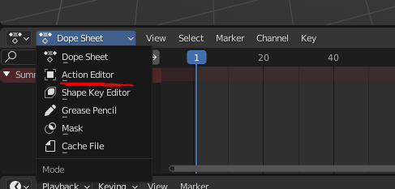

## Making an action clip

- Insert some keyframes for your object, you'll notice an Action called **CubeAction** will be created for you within the **Action Editor**. We'll rename it **RightAction**

- Switch your **Timeline Editor** to **Nonlinear Animation**, you'll notice on the LHS of the panel there's a **RightAction**. As you add more clips the clips will appear there to form a **stack** which will determine the order of operations on your animation clips.

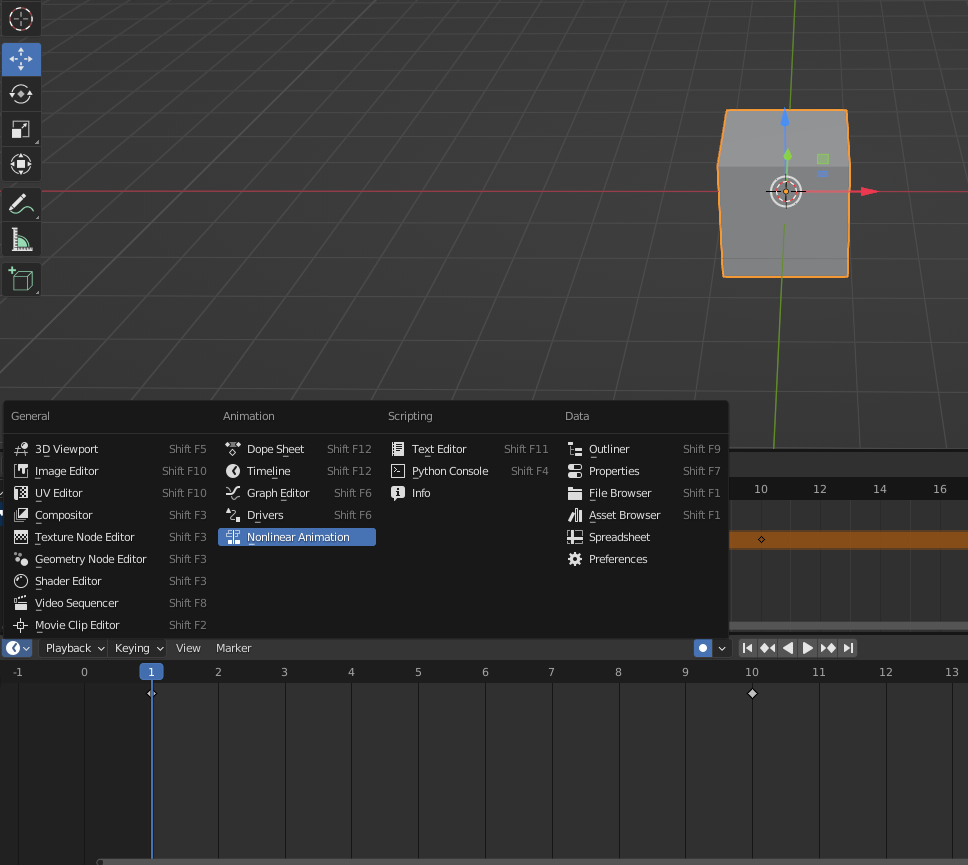

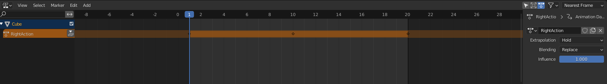

- See [2:01](https://youtu.be/ktHo6Z3QGFg?si=XtM152LNTXRLR2CZ&t=118) for more explanation

## Storing an action clip as NLA Tracks (and for exporting)

- Actions can be stored via the **Push Down** button, both highlighted in red. 

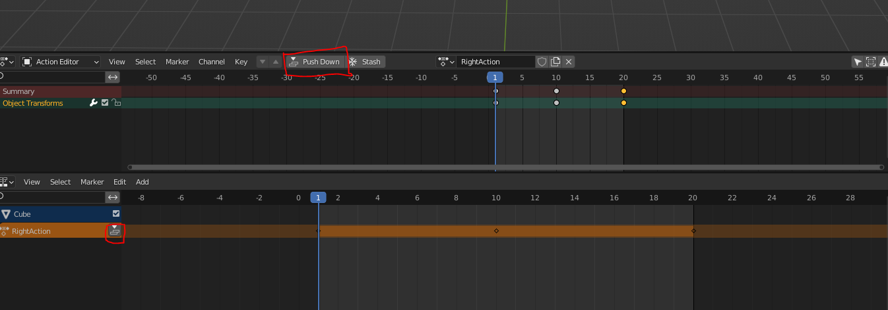

- Notably the top right panel **Scene Collection** will display all NLA Tracks (underlined in red), and have an **Animation** parent showing the current Action.

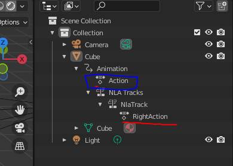

- Storing tracks this way allows exports to work better. For exmaple, GLTF export has a **Group by NLATrack** checkbox

- If you want a new action the **Stash** button next to the **Push Down** button will do it.

## Contributions from NLA tracks to current action

- Add a new action, we're going to combine the 2 previous strips we've made to this action and name it **Combined**. If we play the animation, it should only play the **UpAction**

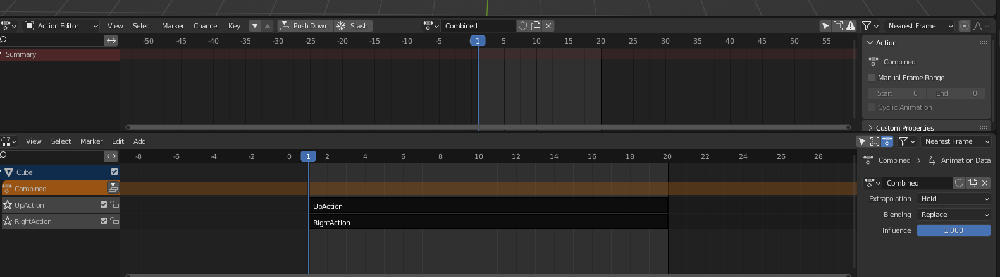

- Notably, the **NonLinear Animation panel** is structured like video editing software. You could move clips around and they would play accordingly.

- Select the **UpAction** track, and you will note a panel on the right will show up. If it does not hit **N** or the arrow on the right side.

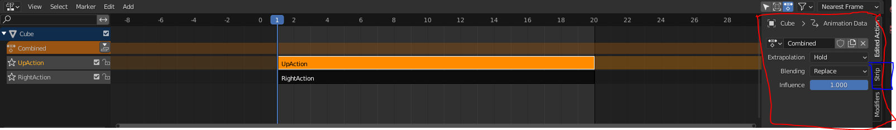

- Click on the **Strip** tab and switch **Blending** from **Replace** to **Combine** and play the animation. You will note that the object now floats to the top right

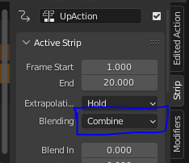

- You may also tick checkboxes to determine which clips contribute to the current animation clip.

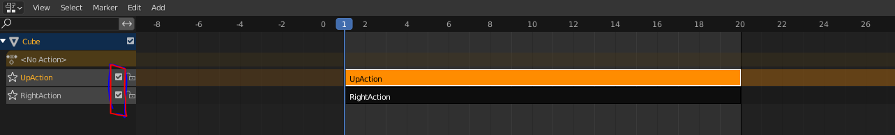

- **Shift-A** is able to add existing actions to the current NLA tracks, make sure you have an existing track selected before you add it in

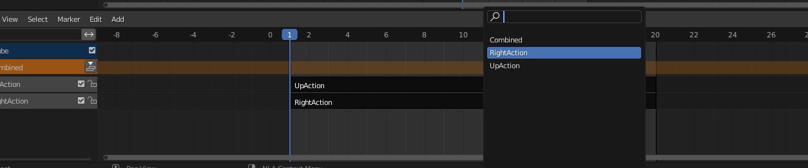

- Finally you can bake the 2 strips via **Edit->Bake Action**, adjust some settings and click ok on the panel popup. New keyframes will appear on the new action.

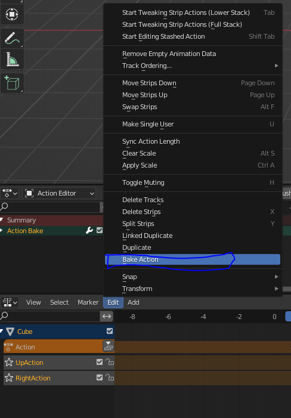  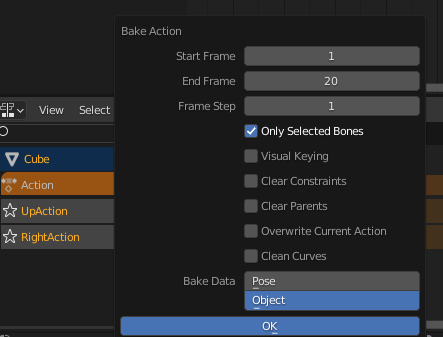

## References

- [How To Use NLA for Animation In Blender](https://www.youtube.com/watch?v=ktHo6Z3QGFg)

- [Combine Mixamo Animations with the NLA Editor in Blender](https://youtu.be/3NrsSdEUSWI?si=dt_MzCSklXa9IaCO&t=508)

- [How to bake NLA( Nonlinear Animation ) to keyframe, new Animation - Blender](https://www.youtube.com/watch?v=yFURoPlZJxs)